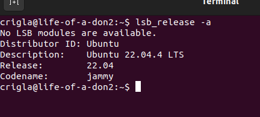
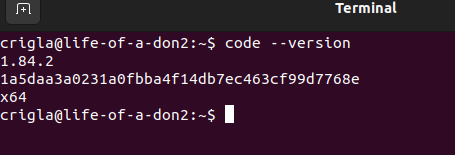
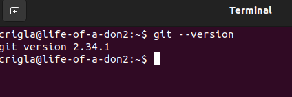
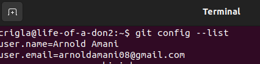
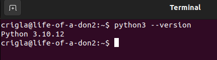
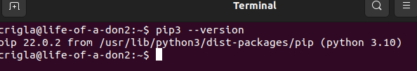
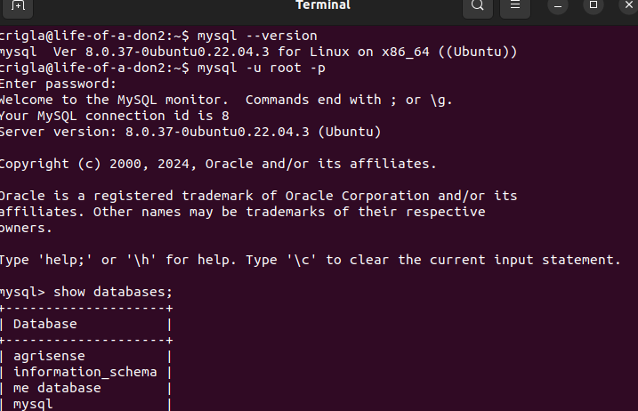
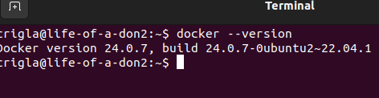
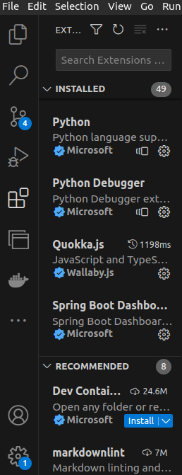

Setting Up My Developer Environment on Ubuntu:

Objective:
This documentation aims to guide you through how I managed setting up a robust developer environment on my Ubuntu, covering essential tools and configurations necessary for software engineering projects.

NB:Since I am an IT student, I did the environment set up way before so I will just provide screenshot/s on each step to prove that everything is O.K.

Tasks:
1. I Selected My Operating System (OS):
Ubuntu is a popular choice for developers due to its stability, security, and vast community support. I Ensured I had Ubuntu installed on your machine before proceeding.

2. I Installed a Text Editor or Integrated Development Environment (IDE):
Visual Studio Code:

Visual Studio Code (VS Code) is a versatile code editor with a plethora of extensions and features.
To install VS Code on Ubuntu, I followed these steps:
I Opened a terminal window.
Run the following commands:
sudo apt update
sudo apt install software-properties-common apt-transport-https wget
wget -q https://packages.microsoft.com/keys/microsoft.asc -O- | sudo apt-key add -
sudo add-apt-repository "deb [arch=amd64] https://packages.microsoft.com/repos/vscode stable main"
sudo apt update
sudo apt install code

3. I Set Up Version Control System:
Git:

Git is essential for version control and collaboration in software development.
I Installed Git using the following command in the terminal:
sudo apt update
sudo apt install git

Configure Git with your username and email:
arduino
Copy code
git config --global user.name "Your Name"
git config --global user.email "your.email@example.com"

I Created a GitHub account for hosting your repositories.
Link:

4. I Installed Necessary Programming Languages and Runtimes:
Python:
Ubuntu comes with Python pre-installed. Verify the installation by running:
python3 --version
If Python is not installed, install it using:
Copy code
sudo apt install python3

5. I Installed Package Managers:
Pip (Python):

Pip should be installed along with Python. Verify the installation by running:
pip3 --version

6. I Configureed a Database (MySQL):
MySQL:

I Installed MySQL database server on Ubuntu by following these steps:
Download the MySQL APT repository package using the following command:
arduino
wget https://dev.mysql.com/get/mysql-apt-config_0.8.15-1_all.deb
Install the MySQL APT repository package:
sudo dpkg -i mysql-apt-config_0.8.15-1_all.deb
Update the package index:
sudo apt update
Install MySQL Server:
sudo apt install mysql-server
Follow the on-screen prompts to set up MySQL, including setting the root password.

7. Set Up Development Environments and Virtualization (Optional):
Docker:

Docker is a popular tool for containerization, allowing you to create isolated environments for your projects.
Install Docker on Ubuntu by following the instructions on the Docker website.

8. I Explored Extensions and Plugins:
Open Visual Studio Code and explore available extensions by navigating to the Extensions view on the sidebar.
I Installed extensions for syntax highlighting, linting, code formatting, and version control integration as per your requirements.

